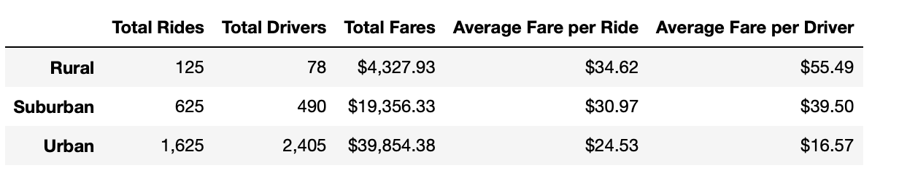
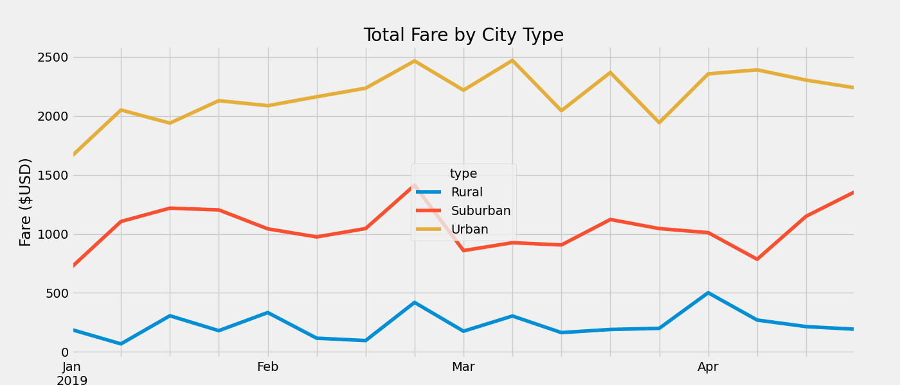

# PyBer_Analysis

## Overview
With rideshare services growing in popularity each year, it is essential to do a deep dive into the data. This comparitive analysis was done using data from three different types of cities: Rural, Suburban, and Urban. The overall analysis and visualizations of data done can help reveal trends and correlation of city type and the number of drivers and riders, and the impact it can have on the fare amount. 

## Results

### Breakdown by City Type

According to the data presented in the table above, it can be concluded that the Urban cities had the highest number of rides. Urban cities also had the highest number of drivers, with the drivers earning on average the lowest amount per ride when compared to Rural and Suburban cities. From the data presented in the table above, it can also be concluded that while Rural cities had the lowest amount of rides, they also had on average the highest fare per ride, and the highest average fare paid per driver. 

### Total Fare by City Type

According to the data presented in the graph, it can be concluded that fare prices for all three city types began to peak in late February before dipping in early March. Leading into April, it can be concluded that fare prices for Urban cities slowly started to rise. In Rural cities we can tell from the graph that fare prices slowly started to decrease. In Suburban cities in April, fares slightly decreased before increasing later into April. 

## Summary 

